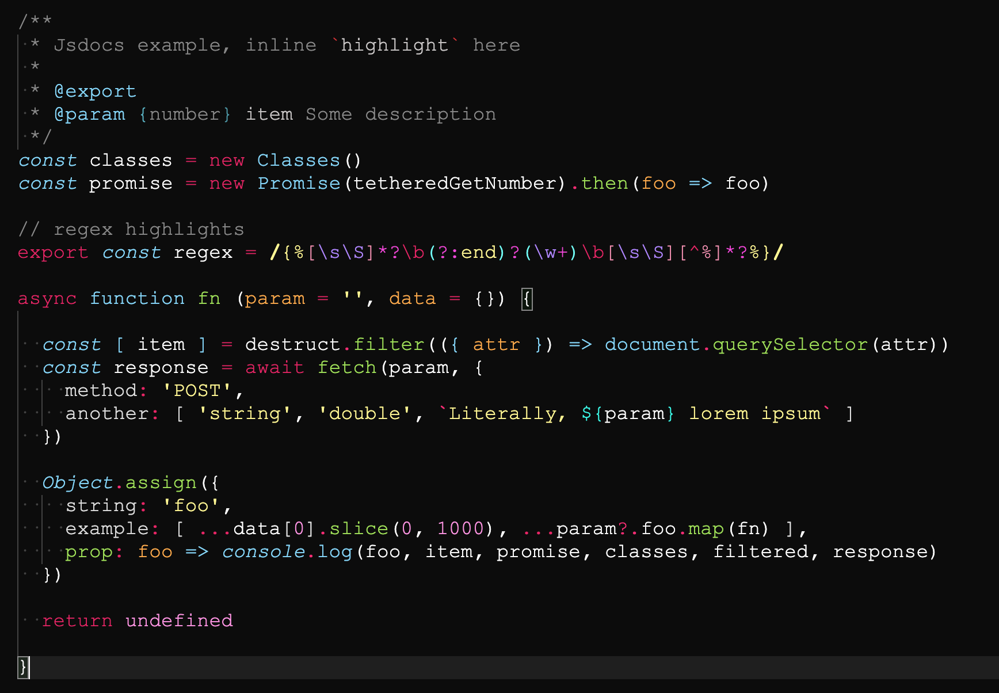

## Material Potion (vscode theme)

[VSCode](#) dark color theme variation of the [Material](#). Implements a [Monokai](#) flavor and cosmic-like syntax colouring on an obsidian black workspace. Material Poition extends JavaScript, HTML and Elixir syntaxes.

> There are no plans to bring wide spread support to this theme as its merely an export generated from within vscode.

### Preview




### Reccommendation

```json
{
  "editor.minimap.enabled": false,
  "editor.matchBrackets": "always",
  "editor.renderWhitespace": "boundary",
  "editor.fontFamily": "'Courier New', monospace",
  "editor.cursorSmoothCaretAnimation": true,
  "editor.fontSize": 17.2,
  "editor.codeLens": true,
  "editor.tabSize": 2,
  "editor.letterSpacing": 0.10,
  "editor.lineHeight": 20,
  "editor.fontWeight": "500",
  "editor.smoothScrolling": true,
  "editor.scrollBeyondLastLine": false,
  "editor.formatOnPaste": false,
  "editor.formatOnSave": false,
  "editor.formatOnType": false,
  "editor.wordWrap": "wordWrapColumn",
  "editor.wordWrapColumn": 96,
  "editor.detectIndentation": true,
  "editor.renderIndentGuides": true,
  "workbench.tree.indent": 5,
  "workbench.tree.renderIndentGuides": "none",
  "workbench.fontAliasing": "default",
  "editor.overviewRulerBorder": false,
  "editor.fastScrollSensitivity": 5,
}
```

🥛 <small>Laced with Moloko Plus by [Νίκος Σαβίδης](mailto:nicos@gmx.com)</small>
